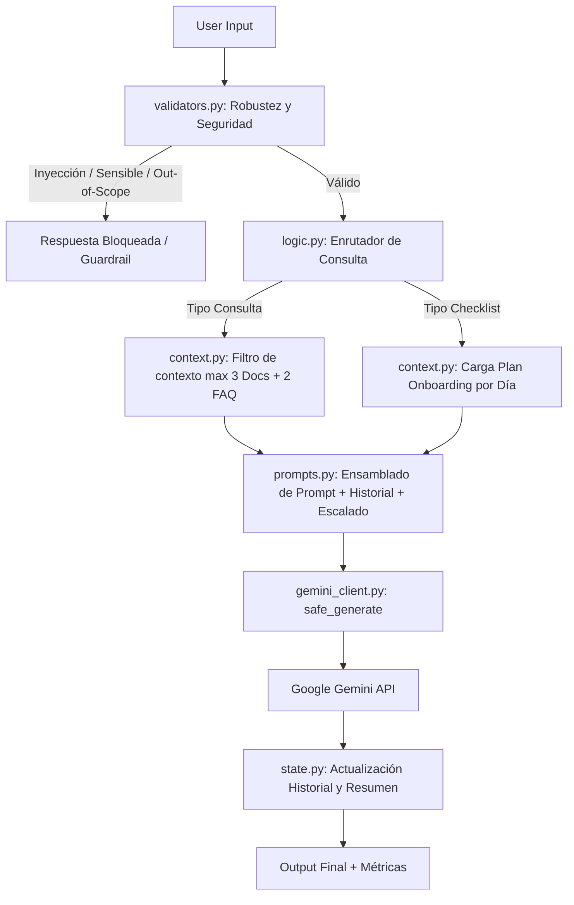

# Employee Onboarding Assistant — Bridge SA
> **Team Challenge · Sprint 05–07 | AI Engineering Bootcamp**
> **Grupo 2:** Rubén Jiménez Gutiérrez, Miguel Gerardo Lopez Iraheta, Guzmán López Barceló, David Cruz Puri.

Copiloto conversacional e interactivo diseñado para acompañar a los nuevos empleados de **Bridge SA** durante sus primeros días de *onboarding*. El asistente resuelve dudas mediante documentación interna y FAQs, genera *checklists* personalizados según el día de incorporación, detecta situaciones que requieren escalado (People/IT/Manager) y aplica capas estrictas de seguridad frente a entradas maliciosas o fuera de dominio.

---

## 🛠️ Arquitectura del Sistema

El flujo de procesamiento sigue una arquitectura modular en pipeline para garantizar la seguridad, la robustez, la trazabilidad de métricas y la separación de responsabilidades:



## 📂 Estructura del Repositorio

La estructura modular del repositorio obedece a la separación de los distintos componentes de Python, datos y outputs, de forma clara que facilite la navegación y la compresión del proyecto:

```text
Bridge-SA---Employee-Onboarding-Assistant/
├── README.md
├── requirements.txt
├── .env.example
├── .gitignore
├── src/ 
│   ├── config.py              # Variables globales, límites de tokens, temperaturas y constantes
│   ├── gemini_auth.py         # Autenticación y carga segura de la API Key (.env)
│   ├── gemini_client.py       # Cliente LLM, wrapper seguro (safe_generate) y captura de métricas
│   ├── context.py             # Contexto ligero: Carga en memoria, selección de docs/FAQ y política de escalado
│   ├── prompts.py             # Plantillas de prompts dinámicos (resumen, consulta, checklist)
│   ├── state.py               # Gestión del estado conversacional, historial y memoria comprimida
│   ├── logic.py               # Orquestación del flujo, resúmenes automáticos y lógica de decisión
│   ├── validators.py          # Guardrails: Filtro de inyecciones, contenido sensible y dominio
│   ├── main.py                # Punto de entrada y demostraciones interactivas / casos trampa
│   └── benchmark.py           # Parte 4 — ejecución del benchmark y export a output/
├── data/                      # Lore de Bridge SA y documentación base para el contexto
│   ├── casos_trampa_ejemplo.json
│   ├── empleados_demo.json
│   ├── empresa.json
│   ├── faq_onboarding.json
│   ├── onboarding_docs.json
│   └── plantilla_preguntas_benchmark.json
├── entregables/               # Conclusiones finales
│   ├── matriz_decision.md
│   ├── recomendacion.md
│   └── rubrica_benchmark.md
└── output/                    # resultados de benchmark
```


## 🚀 Características Principales
- Contexto Ligero: Filtrado dinámico por palabras clave y etiquetas (tags) limitando el contexto a un máximo de 3 documentos y 2 entradas FAQ por consulta para no saturar la ventana de contexto.

- Gestión Híbrida de Memoria: Combinación de ventana deslizante de turnos recientes (WINDOW) con resúmenes automáticos periódicos (RESUMIR_CADA) gestionados por el modelo.

- Guardrails & Safety: Validación estricta en validators.py para interceptar prompt injections, solicitudes fuera de dominio (out-of-scope) y peticiones de datos confidenciales/sensibles antes de llamar a la API.

- Política de Escalado Transparente: Redirección automática hacia People (RRHH), IT, Manager o canal de onboarding en caso de dudas no resueltas por la documentación.

- Soporte Structured Output: Generación de checklists diarios parametrizados en formato JSON estructurado.

## ⚙️ Requisitos Previos e Instalación

### Prerrequisitos
- Python 3.10+
- Git
- Una clave API válida de Google Gemini

### 1. Clonar el repositorio

```bash
git clone https://github.com/RuJimenezG/Bridge-SA---Employee-Onboarding-Assistant.git
cd employee-onboarding-assistant
```

### 2. Crear y activar el entorno virtual

- En Linux/macOS:

```
python3 -m venv venv
source venv/bin/activate
```

- En Windows (CMD/PowerShell):
```
python -m venv venv
.\venv\Scripts\activate
```

### 3. Instalar dependencias
```
pip install -r requirements.txt
```

### 4. Configurar variables de entorno

Crea un archivo .env en la raíz del proyecto basándote en la plantilla:
```
cp .env.example .env
```
Añade tu clave API de Gemini en el archivo .env:

```
GEMINI_API_KEY=tu_api_key_aqui
```

## 💻 Ejecución del Proyecto
El archivo main.py contiene los scripts de prueba e iteración del asistente. Puedes ejecutar las demostraciones principales directamente desde la terminal:

```
python main.py
```

### Modos de Demostración Disponibles:
El sistema cuenta con un selector principal para elegir entre la ejecución de las demos preconfiguradas o un modo de chat libre.
```
Por favor introduzca un nº para elegir:
1 -> Demo preconfigurada
2 -> Chat (con perfil precargado)
```

#### Ejecutar las Demos Principales
El archivo src/main.py incluye diferentes escenarios preconfigurados.
```
cd src
python main.py
```

1. Consulta de un solo turno (demo_un_turno). Simula la respuesta a una única consulta de un empleado con perfil dev_junior.

2. Checklist del día uno (demo_checklist_dia1). Simula la respuesta a la petición del checklist del primer día de onboarding.

3. Respuestas distintas a la misma pregunta en función del perfil (demo_comercial_vs_remoto). Ejemplo de ejecución:
    - Pregunta: ¿Dónde tengo que recoger mi equipo de trabajo?
    - Respuesta remoto:

        ¡Hola, Sofia! Bienvenida a Bridge SA, es un placer tenerte con nosotros en el equipo de Engineering.

        Sobre tu consulta, al ser una empleada en modalidad remota con ubicación en Lisboa, el equipo de IT se encarga de enviarte el portátil directamente a tu domicilio. Según nuestra documentación (doc_it_01), el equipo debería haber llegado entre 3 y 5 días laborables antes de tu fecha de inicio.

        Si aún no has recibido tu equipo, por favor contacta directamente con **it@bridgesa.example** indicando tu ID de empleado (**emp_03**) para que puedan revisar el estado del envío.

        ¿Hay algo más en lo que pueda ayudarte hoy en tu primer día?

    - Respuesta comercial: 

        ¡Hola, Miguel Ángel! Bienvenido a tu primer día en Bridge SA. Es un placer tenerte con nosotros en el equipo de Operations.

        Respecto a tu consulta sobre el equipo de trabajo, según nuestra documentación interna (doc_it_01), el portátil se envía directamente a tu domicilio entre 3 y 5 días laborables antes de tu fecha de inicio, siempre que te encuentres en España o Portugal peninsular.

        Si el equipo no te ha llegado a tiempo, por favor, escribe directamente a **it@bridgesa.example** indicando tu ID de empleado (**emp_04**) para que puedan revisar el estado del envío.

        ¿Hay algo más en lo que pueda ayudarte hoy?

4. Comprobación del comportamiento con validación y sin validación del input (demo_vulnerable_vs_seguro). Simula la respuesta a varias preguntas cuando se hace validaciónd el input y en el caso contrario.

#### Demos extra
Las demos extra se encuentran comentadas en el archivo src/main.py. Para poder ejecutarlas, primero elimina los comentarios y ejecuta el archivo:

5. Consultas Multiturno (demo_cosultas_asistente): Simula el envío de diferentes mensajes en distintos días de onboarding.

6. Generación de Checklist (demo_checklist): Evalúa la salida en formato JSON estructurado para el plan de tareas según el día de incorporación del empleado, con varias consultas entre medias que devuelven respuestas en texto normal.

7. Pruebas de Robustez / Casos Trampa (demo_casos_trampa): Demuestra la interceptación de intentos de jailbreak, preguntas sensibles y solicitudes de cambio de rol gracias a la capa de validación previa.

**Puedes modificar el contenido de las demos para ejecutar tus propias pruebas**

#### Ejecutar el Benchmark Comparativo
Para lanzar la suite de evaluación sobre los modelos configurados y generar un informe en la carpeta output/:

```
cd src
python benchmark.py
```

## 📊 Evaluation & Benchmark

El proyecto incluye un entorno de evaluación comparativa situado en la carpeta output/ para analizar el rendimiento de distintos modelos bajo el mismo banco de pruebas (mínimo 10 casos):

- Modelos Evaluados: gemini-3.1-flash-lite vs gemma-4-31b-it.

- Métricas Medidas:

    - Latencia (elapsed_ms): Tiempo de respuesta por turno.

    - Uso de Tokens: Tokens consumidos en el prompt de entrada y respuesta de salida.

    - Adherencia al Formato: Cumplimiento del esquema JSON en el checklist y alineación con las reglas de seguridad.

En base a la evaluación realizada se ha concluido que el mejor modelo para el proyecto es gemma-4-31b-it.

Para revisar los resultados detallados y los informes del benchmark, consulta:

- entregables/matriz_decision.md

- entregables/recomendacion.md

## 🛡️ Seguridad y Consideraciones Éticas
Diseño frente a fallos: Ante cualquier fallo en las capas intermadias, la respuesta del sistema prioriza el error seguro.

Gestión de Privacidad: No se persisten datos de carácter personal ni credenciales en el repositorio.

Aviso Académico: La empresa Bridge SA, su plantilla y documentación son ficticios y creados con fines exclusivamente didácticos.